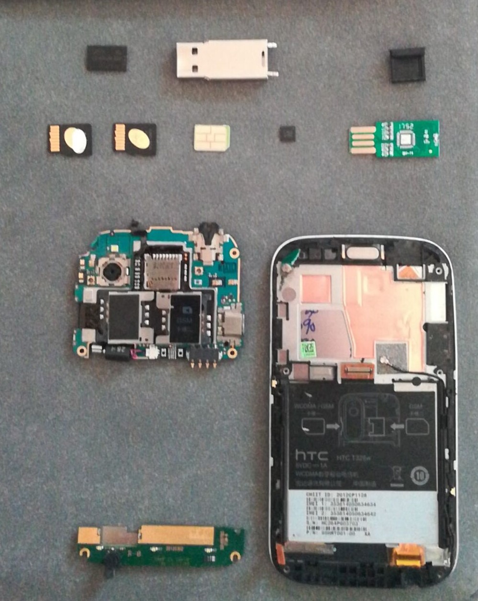

最开始我看着那只小小的金属u盘的时候甚至是想要用切割机（也可以叫无齿电锯）把它切开的，还好被阻止了，不然我都担心没有手的我会造成什么不可饶恕的后果，它居然可以，果然可以？用一个非常优雅的方法打开金属外壳，取下主控芯片和闪存芯片我是用的风枪，果然比电烙铁+吸锡器好用许多。

拆解之后就是这样，小小的几只弱小可怜又无助还很齐齐整整

##  闪存颗粒（或者叫闪存芯片）

wafer（薄脆饼）从沙子里面高温拉伸生长出来的高纯度硅晶体柱(Crystal Ingot)上切下来的圆形薄片

主要有NAND Flash与NOR Flash两种(这个命名方式就十分明确），NAND Flash内部结构是由与非门组成，而NOR Flash则由或非门组成。

NAND Flash容量大，速度快，可擦写次数也更多一些

NOR Flash容量小，可随机访问，价格低，而且代码可以直接在上面运行

### NOR Flash

NOR Flash可以分为并行（parallel）NOR Flash与串行（serial)NOR Flash两类

并行Flash有48pin、56pin等，输出数据总线有8bit和16bit，地址线根据Flash容量不同，可以有20根或更多。并行Flash不需要MCU上有特殊的控制器，直接给各地址线、控制信号发相应的信号，就可以在数据线上输出相应的内容。

串行Flash，简称SPI Flash，一般只有8pin或者16pin，器件尺寸可以做得很小，通过串行的bit操作实现数据的访问，需要MCU上有SPI Flash控制器的支持，以进行SPI Flash的读写操作（至少要能实现bit与Byte的转换）；由于是串行操作，因此SPI Flash的擦除、写入操作比并行Flash要慢（这还跟CPU的SPI Flash控制器的实现有关，如一次缓冲的大小等），因此经常会感觉firmware升级时间比较长。

### NAND Flash

#### SLC

全称"Single-Level Cell”（单层式储存),是指一个Block（块,Flash的基本存储单元,也可称为Cell）只有两种电荷值,高低不同的电荷值表明0或者1,因为只需要一组高低电压就可以区分出0或者1信号,所以SLC最大的驱动电压可以做到很低。

SLC因为结构简单,在写入数据时电压变化的区间小,所以寿命较长,传统的SLC Flash可以经受10万次的读写,因此出现坏Block的几率较小,因为存储结构非常简单,一组电压即可驱动,所以其速度表现更好,目前所有的超高速卡都采用SLC类型的Flash芯片.不过这种一个Block只存储一组数据的模式无法在相同的晶圆面积上实现较高的存储密度（所以同样大小他要贵）

#### MLC

全称“Multi-Leveled Cell"(多层式储存），是指一个Block中记录两组位信息（00、01、11、10），可以说是将原本SLC的记录密度理论提升了几乎一倍，但是有得必有失呀，一个block放两组数据，需要的时间自然更长一些，而且很明显，电压控制也更复杂，寿命也要短很多（1万次）

#### TLC

全称“Triple-Level Cell”，同上

#### QLC

英文全称“Quad-Level Cell”，同上

## 主控

U盘主控是U盘的计算、控制芯片，负责检测U盘供电，数据读写任务分配等，主控的好坏决定了U盘的速度和稳定性！！

u盘目前就是两大类主控，普通usb主控，ssd主控，接口其实是SATA,然后SATA to USB。

不如再看一下M.2接口，既然提到了SATA。

它支持传统SATA和PCI Express存储设备，包括AHCI和NVMe作为逻辑设备接口

传统SATA
用于SATA SSD，以及通过M.2连接器分拆出的AHCI驱动程序和旧式SATA 3.0 (6 Gbit/s)端口。
使用AHCI的PCI Express
用于PCI Express SSD和通过AHCI驱动程序和PCI Express通道提供的接口，使用AHCI访问PCI Express SSD，利用广泛的SATA支持在操作系统层面以提供非最佳性能的向下兼容。开发AHCI的时候, 系统的主机总线适配器 (HBA)的用途是将CPU/内存子系统通过一个相比慢得多的基于旋转磁介质的存储子系统相连，正因如此，AHCI在用于SSD设备时有一些固有的低性能问题，因为其行为更类似DRAM而非旋转介质。
使用NVMe的PCI Express
用于PCI Express SSD和通过NVMe驱动程序和PCI Express通道提供的接口，作为一个高性能并可扩展的主机连接器接口设计，尤其是专门为PCI Express SSD的接口而优化。NVMe已全新设计，为PCI Express SSD提供低延迟和并行性，助益现代CPU、平台和应用程序的并行性。在高层次水平，NVMe相比AHCI的主要优势是NVMe能充分、并行地利用主机的硬件和软件，它的设计优势包括更少的数据传输层级，更大的命令队列，以及更有效的中断处理。

## 摸鱼的一天

暴力破坏真好玩~

尤其是不用考虑安装回去的情况下

## 日渐肥硕的猫

